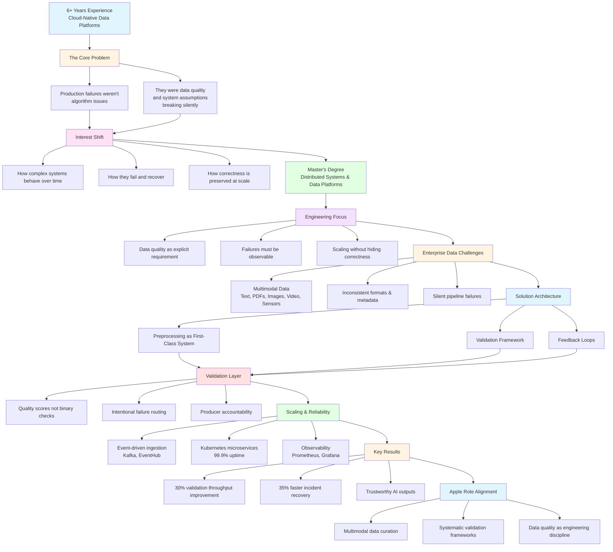
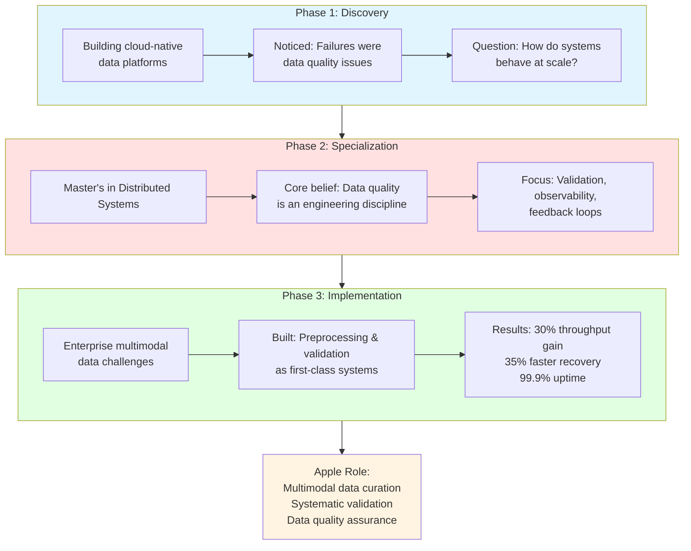

# Apple Interview Presentation Plan

## Overview
This document contains a clean, high-level Mermaid diagram and recommendations for presenting your data engineering journey during your Apple interview.

---

## Mermaid Diagram: Data Engineering Journey



---

## Alternative: Linear Journey Diagram

```mermaid
flowchart LR
    A[Early Career<br/>Building Features] --> B[Observation<br/>Production failures<br/>were data issues]
    
    B --> C[Curiosity<br/>System behavior<br/>at scale]
    
    C --> D[Master's Degree<br/>Distributed Systems]
    
    D --> E[Core Principle<br/>Data quality is<br/>explicit not implicit]
    
    E --> F[Enterprise Problem<br/>Multimodal data<br/>inconsistent quality]
    
    F --> G[Architecture Shift<br/>Preprocessing as<br/>first-class system]
    
    G --> H[Validation Framework<br/>Quality scores<br/>Feedback loops]
    
    H --> I[Scale & Reliability<br/>Kafka, K8s<br/>Observability]
    
    I --> J[Apple Alignment<br/>Data curation<br/>Quality assurance]
    
    style A fill:#e1f5ff
    style B fill:#fff4e1
    style C fill:#ffe1f5
    style D fill:#e1ffe1
    style E fill:#f5e1ff
    style F fill:#fff4e1
    style G fill:#e1f5ff
    style H fill:#ffe1e1
    style I fill:#e1ffe1
    style J fill:#fff4e1
```



---

## Simplified: Three-Phase Journey



---

## Recommendations for Using Your Portfolio

### 1. **Portfolio as Visual Anchor**
- Open your portfolio on a second screen or share it during the presentation
- Use it to show your technical breadth while you narrate your focused story
- The IDE-style interface demonstrates your developer mindset

### 2. **Strategic Navigation Points**

#### **During Background Section (Minutes 1-3)**
- Navigate to [`Hero.tsx`](../src/components/Sections/Hero.tsx) section showing your summary
- Briefly show the tech stack visualization to establish credibility
- **Key message**: "This portfolio itself is built with React, TypeScript, and modern DevOps practices"

#### **During Technical Deep Dive (Minutes 4-15)**
- Navigate to [`Experience.tsx`](../src/components/Sections/Experience.tsx) section
- Highlight AbbVie experience showing:
  - Azure Data Factory, Databricks, Kafka
  - 99.9% availability achievement
  - 35% incident resolution improvement
- **Key message**: "These aren't just bullet points - they represent systematic approaches to data quality"

#### **During Projects Section (Minutes 16-18)**
- Navigate to [`Projects.tsx`](../src/components/Sections/Projects.tsx)
- Show relevant projects:
  - **AI-Powered Data Analyst Agent**: Demonstrates understanding of data quality in analytics
  - **LLM Fine-Tuning**: Shows multimodal data handling
- **Key message**: "I build tools that solve real data problems, not just features"

#### **During Closing (Minutes 19-20)**
- Navigate to [`Skills.tsx`](../src/components/Sections/Skills.tsx)
- Show the comprehensive skill matrix
- **Key message**: "My toolkit aligns directly with Apple's data infrastructure needs"

### 3. **Presentation Flow Strategy**

```
Opening (1 min)
├─ Show portfolio homepage
└─ "This is how I think about engineering - structured, observable, maintainable"

Background (2-3 min)
├─ Keep portfolio visible but don't navigate
└─ Focus on your narrative

Technical Deep Dive (10 min)
├─ Use Mermaid diagram as primary visual
├─ Reference portfolio for specific achievements
└─ Navigate to Experience section when discussing metrics

Projects Connection (2 min)
├─ Navigate to Projects section
└─ Show 1-2 relevant projects quickly

Closing (1 min)
├─ Show Skills section
└─ "Everything here maps to what Apple needs"
```

### 4. **Technical Talking Points from Portfolio**

From your [`profile.ts`](../src/data/profile.ts), emphasize:

- **Multimodal Data Experience**: Text, PDFs, images, video, sensor data
- **Cloud Platforms**: Azure (ADF, Databricks, EventHub, ADLS) + AWS
- **Data Quality Tools**: Kafka, Spark, Prometheus, Grafana
- **Reliability Metrics**: 99.9% uptime, 35% faster recovery, 40% efficiency gains
- **Scale**: 1M+ curated records, sub-second latency

### 5. **Portfolio Advantages**

✅ **Shows, not just tells**: Live demonstration of your engineering skills
✅ **Modern tech stack**: React, TypeScript, Vite - shows you stay current
✅ **Clean architecture**: IDE-style layout demonstrates design thinking
✅ **Deployed and live**: Proves you ship production-ready code
✅ **Attention to detail**: Animations, responsive design, professional polish

### 6. **What NOT to Do**

❌ Don't spend too much time navigating the portfolio
❌ Don't get distracted by implementation details
❌ Don't mention specific project names from current work
❌ Don't let the portfolio overshadow your narrative
❌ Don't apologize for anything in the portfolio

### 7. **Backup Plan**

If technical issues occur:
- Have screenshots of key portfolio sections ready
- Have your resume PDF accessible
- Focus on the Mermaid diagram as primary visual
- Your narrative is strong enough to stand alone

---

## Recommended Diagram Choice

**Use the "Simplified: Three-Phase Journey" diagram** because:

1. ✅ Clean and uncluttered
2. ✅ Clear progression story
3. ✅ Easy to follow during presentation
4. ✅ Highlights key metrics
5. ✅ Shows direct Apple alignment
6. ✅ No mention of specific project names
7. ✅ Focuses on problems solved, not products built

---

## Practice Tips

1. **Timing**: Practice with a timer - 20 minutes goes fast
2. **Transitions**: Smooth transitions between diagram and portfolio
3. **Metrics**: Memorize your key numbers (99.9%, 35%, 30%)
4. **Questions**: Prepare for deep dives on any section
5. **Confidence**: You've built impressive systems - own it

---

## Final Checklist

- [ ] Test portfolio loads quickly on presentation device
- [ ] Verify Mermaid diagram renders correctly in your presentation tool
- [ ] Practice navigating portfolio smoothly
- [ ] Prepare 2-3 specific examples for each phase
- [ ] Have backup screenshots ready
- [ ] Test screen sharing if remote interview
- [ ] Rehearse timing with diagram + portfolio navigation

---

Good luck with your Apple interview! Your experience with data quality, validation frameworks, and scalable systems aligns perfectly with their needs.
