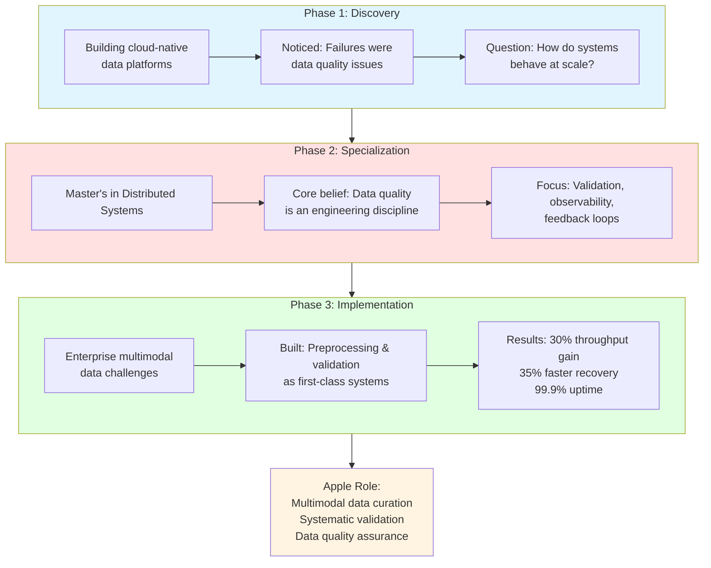

# Apple Interview Presentation - Portfolio Integration Plan

## Overview
This plan outlines how to integrate an interactive presentation feature into your portfolio, allowing you to present your data engineering journey directly from your website during the Apple interview.

---

## Architecture Analysis

### Current Portfolio Structure
- **Framework**: React 19 + TypeScript + Vite
- **Styling**: Tailwind CSS
- **Animations**: Framer Motion
- **Layout**: IDE-themed with sidebar navigation, tabs, and terminal
- **File Structure**: Component-based with sections (Hero, About, Skills, Experience, Projects, Contact)

### Key Components
1. [`IDELayout.tsx`](../src/components/Layout/IDELayout.tsx) - Main layout controller
2. File tree navigation system with folders and files
3. Tab-based content display
4. Component mapping system for rendering different sections

---

## Presentation Component Architecture

### Design Philosophy
Create a **slide-based presentation component** that:
- Fits naturally into the existing IDE theme
- Uses keyboard navigation (arrow keys, space)
- Supports fullscreen mode
- Includes progress indicators
- Renders Mermaid diagrams
- Maintains professional Apple-worthy aesthetics

### Component Structure

```
src/components/Presentation/
├── Presentation.tsx          # Main presentation container
├── PresentationSlide.tsx     # Individual slide component
├── PresentationControls.tsx  # Navigation controls
├── PresentationProgress.tsx  # Progress indicator
├── MermaidDiagram.tsx        # Mermaid diagram renderer
└── slides/
    ├── index.ts              # Slide configuration
    ├── OpeningSlide.tsx      # Slide 1: Opening
    ├── BackgroundSlide.tsx   # Slide 2: Background
    ├── JourneySlide.tsx      # Slide 3: Journey diagram
    ├── DiscoverySlide.tsx    # Slide 4: Phase 1
    ├── SpecializationSlide.tsx # Slide 5: Phase 2
    ├── ImplementationSlide.tsx # Slide 6: Phase 3
    ├── ResultsSlide.tsx      # Slide 7: Results
    └── ClosingSlide.tsx      # Slide 8: Closing
```

---

## Slide Content Structure

### Slide 1: Opening (1 min)
**Content:**
- Title: "Data Engineering Journey"
- Subtitle: "From Discovery to Implementation"
- Your name and role
- Apple logo/reference (subtle)

**Visual:**
- Clean, minimal design
- Animated entrance
- Professional color scheme

---

### Slide 2: Background & Mindset (2-3 min)
**Content:**
- 6+ years experience
- Cloud-native data platforms
- Multimodal data (text, PDFs, images, video, sensors)
- Key insight: "Production failures weren't algorithm issues - they were data quality issues"

**Visual:**
- Icon grid showing data types
- Timeline visualization
- Key stats highlighted

---

### Slide 3: The Journey - Mermaid Diagram (3 min)
**Content:**
- Three-phase journey diagram (from previous plan)
- Interactive/animated reveal

**Mermaid Diagram:**


---

### Slide 4: Phase 1 - Discovery (2 min)
**Content:**
- Early career building features
- Observation: Production failures were data issues, not code issues
- Curiosity about system behavior at scale
- Questions that emerged:
  - How do complex systems behave over time?
  - How do they fail and recover?
  - How is correctness preserved at scale?

**Visual:**
- Problem/solution split screen
- Animated icons showing failure scenarios
- Quote highlight: "Data quality issues breaking silently"

---

### Slide 5: Phase 2 - Specialization (2 min)
**Content:**
- Master's degree in Distributed Systems
- Core principle developed: "Data quality is explicit, not implicit"
- Engineering focus areas:
  - Data quality as explicit requirement
  - Failures must be observable
  - Scaling without hiding correctness

**Visual:**
- Education badge/icon
- Three pillars visualization
- Tech stack icons (subtle)

---

### Slide 6: Phase 3 - Implementation (3 min)
**Content:**
- Enterprise challenges:
  - Multimodal data (text, PDFs, images, video, sensors)
  - Inconsistent formats and metadata
  - Silent pipeline failures
- Solution architecture:
  - Preprocessing as first-class system
  - Validation framework with quality scores
  - Feedback loops for producer accountability
- Technology stack:
  - Kafka, EventHub for event-driven ingestion
  - Kubernetes microservices
  - Prometheus, Grafana for observability

**Visual:**
- Architecture diagram (simplified)
- Tech stack logos
- Data flow visualization

---

### Slide 7: Results & Impact (2 min)
**Content:**
- Key metrics:
  - ✅ 30% validation throughput improvement
  - ✅ 35% faster incident recovery
  - ✅ 99.9% uptime across regions
  - ✅ Trustworthy AI outputs
- Lessons learned:
  - Data quality improves when producers see failures early
  - Observability is critical for silent failures
  - Validation should produce quality scores, not binary checks

**Visual:**
- Metric cards with animations
- Before/after comparison
- Success indicators

---

### Slide 8: Apple Alignment & Closing (2 min)
**Content:**
- Direct alignment with Apple role:
  - ✅ Multimodal data curation
  - ✅ Systematic validation frameworks
  - ✅ Data quality as engineering discipline
  - ✅ Scalable data assurance operations
  - ✅ Feedback loops between consumers and generators
- Core belief: "Data quality is an engineering discipline, not a manual cleanup task"
- Call to action: "I design systems assuming data is unreliable by default"

**Visual:**
- Alignment checklist with checkmarks
- Apple-themed color accents
- Professional closing statement

---

## Technical Implementation Plan

### Phase 1: Setup & Dependencies
**Tasks:**
1. Install Mermaid library for diagram rendering
   ```bash
   npm install mermaid
   npm install @types/mermaid --save-dev
   ```
2. Create presentation folder structure
3. Set up TypeScript types for presentation

**Files to create:**
- `src/types/presentation.ts`
- `src/components/Presentation/` directory

---

### Phase 2: Core Presentation Component
**Tasks:**
1. Create main [`Presentation.tsx`](../src/components/Presentation/Presentation.tsx) component
   - State management for current slide
   - Keyboard navigation (arrow keys, space, escape)
   - Fullscreen API integration
   - Slide transition animations (Framer Motion)

2. Create [`PresentationSlide.tsx`](../src/components/Presentation/PresentationSlide.tsx)
   - Slide container with consistent styling
   - Animation support
   - Content area with proper spacing

3. Create [`PresentationControls.tsx`](../src/components/Presentation/PresentationControls.tsx)
   - Previous/Next buttons
   - Slide counter (e.g., "3 / 8")
   - Fullscreen toggle
   - Exit button

4. Create [`PresentationProgress.tsx`](../src/components/Presentation/PresentationProgress.tsx)
   - Progress bar at bottom
   - Slide indicators (dots)

**Key Features:**
- Keyboard shortcuts:
  - `→` or `Space`: Next slide
  - `←`: Previous slide
  - `F` or `F11`: Toggle fullscreen
  - `Esc`: Exit presentation
- Smooth transitions using Framer Motion
- Responsive design (works on mobile too)

---

### Phase 3: Mermaid Diagram Integration
**Tasks:**
1. Create [`MermaidDiagram.tsx`](../src/components/Presentation/MermaidDiagram.tsx)
   - Initialize Mermaid on mount
   - Render diagram from string
   - Handle theme (dark mode)
   - Error handling

2. Configure Mermaid theme to match portfolio
   ```typescript
   mermaid.initialize({
     theme: 'dark',
     themeVariables: {
       primaryColor: '#3b82f6',
       primaryTextColor: '#fff',
       primaryBorderColor: '#60a5fa',
       lineColor: '#94a3b8',
       secondaryColor: '#8b5cf6',
       tertiaryColor: '#10b981',
     }
   });
   ```

---

### Phase 4: Individual Slide Components
**Tasks:**
1. Create each slide component in `src/components/Presentation/slides/`
2. Import and configure in `slides/index.ts`
3. Add content, styling, and animations
4. Test transitions between slides

**Slide Configuration Example:**
```typescript
// src/components/Presentation/slides/index.ts
export interface SlideConfig {
  id: string;
  title: string;
  component: React.ComponentType;
  duration?: number; // suggested duration in seconds
}

export const slides: SlideConfig[] = [
  { id: 'opening', title: 'Opening', component: OpeningSlide, duration: 60 },
  { id: 'background', title: 'Background', component: BackgroundSlide, duration: 180 },
  { id: 'journey', title: 'Journey', component: JourneySlide, duration: 180 },
  // ... more slides
];
```

---

### Phase 5: Portfolio Integration
**Tasks:**
1. Add presentation to file tree in [`IDELayout.tsx`](../src/components/Layout/IDELayout.tsx)
   ```typescript
   {
     id: "presentations",
     name: "PRESENTATIONS",
     type: "folder",
     expanded: false,
     children: [
       {
         id: "apple-presentation",
         name: "portfolio.pptx",
         type: "file",
         icon: "📊",
         component: "presentation",
       },
     ],
   }
   ```

2. Add presentation to component map
   ```typescript
   const componentMap: Record<string, React.ComponentType> = {
     hero: Hero,
     about: About,
     skills: Skills,
     experience: Experience,
     projects: Projects,
     contact: Contact,
     presentation: Presentation, // NEW
   };
   ```

3. Style presentation to fit IDE theme
4. Test navigation and transitions

---

### Phase 6: Styling & Polish
**Tasks:**
1. Create presentation-specific CSS/Tailwind classes
2. Ensure consistent typography
3. Add smooth animations
4. Test fullscreen mode
5. Optimize for different screen sizes
6. Add loading states for Mermaid diagrams

**Design Guidelines:**
- Use portfolio color scheme
- Maintain IDE aesthetic
- Professional, clean, minimal
- Apple-worthy polish
- Smooth transitions (300-500ms)
- Readable fonts (larger sizes for presentation)

---

### Phase 7: Testing & Refinement
**Tasks:**
1. Test keyboard navigation
2. Test on different browsers (Chrome, Safari, Firefox)
3. Test on different screen sizes
4. Practice presentation timing
5. Verify Mermaid diagrams render correctly
6. Check for any performance issues
7. Test fullscreen mode

---

## File Structure After Implementation

```
src/
├── components/
│   ├── Presentation/
│   │   ├── Presentation.tsx
│   │   ├── PresentationSlide.tsx
│   │   ├── PresentationControls.tsx
│   │   ├── PresentationProgress.tsx
│   │   ├── MermaidDiagram.tsx
│   │   └── slides/
│   │       ├── index.ts
│   │       ├── OpeningSlide.tsx
│   │       ├── BackgroundSlide.tsx
│   │       ├── JourneySlide.tsx
│   │       ├── DiscoverySlide.tsx
│   │       ├── SpecializationSlide.tsx
│   │       ├── ImplementationSlide.tsx
│   │       ├── ResultsSlide.tsx
│   │       └── ClosingSlide.tsx
│   └── ... (existing components)
├── types/
│   ├── index.ts
│   └── presentation.ts (NEW)
└── data/
    └── presentationContent.ts (NEW - optional)
```

---

## TypeScript Types

```typescript
// src/types/presentation.ts
export interface SlideConfig {
  id: string;
  title: string;
  component: React.ComponentType<SlideProps>;
  duration?: number;
  notes?: string;
}

export interface SlideProps {
  isActive: boolean;
  direction: 'forward' | 'backward';
}

export interface PresentationState {
  currentSlide: number;
  totalSlides: number;
  isFullscreen: boolean;
  isPlaying: boolean;
}

export interface MermaidDiagramProps {
  chart: string;
  id: string;
  className?: string;
}
```

---

## Keyboard Shortcuts Reference

| Key | Action |
|-----|--------|
| `→` or `Space` | Next slide |
| `←` | Previous slide |
| `Home` | First slide |
| `End` | Last slide |
| `F` or `F11` | Toggle fullscreen |
| `Esc` | Exit presentation |
| `?` | Show keyboard shortcuts (optional) |

---

## Presentation Features

### Must-Have Features
✅ Slide navigation (prev/next)
✅ Keyboard shortcuts
✅ Progress indicator
✅ Mermaid diagram rendering
✅ Smooth transitions
✅ Fullscreen mode
✅ Responsive design
✅ IDE theme integration

### Nice-to-Have Features
⭐ Slide notes (presenter view)
⭐ Timer/clock display
⭐ Slide thumbnails sidebar
⭐ Export to PDF
⭐ Slide transitions (fade, slide, zoom)
⭐ Laser pointer effect (mouse highlight)
⭐ Auto-advance slides (optional)

---

## Design Mockup (Text-based)

```
┌─────────────────────────────────────────────────────────────┐
│  📊 apple-interview.pptx                              [×]    │
├─────────────────────────────────────────────────────────────┤
│                                                               │
│                                                               │
│                  DATA ENGINEERING JOURNEY                     │
│                                                               │
│              From Discovery to Implementation                 │
│                                                               │
│                                                               │
│                        Raju Yallappa                          │
│                   Data & Cloud Engineer                       │
│                                                               │
│                                                               │
│                                                               │
├─────────────────────────────────────────────────────────────┤
│  [←]  [→]  [⛶]  [Esc]                          Slide 1 / 8  │
│  ████████░░░░░░░░░░░░░░░░░░░░░░░░░░░░░░░░░░░░░░░░░░░░░░░░  │
└─────────────────────────────────────────────────────────────┘
```

---

## Usage During Interview

### Setup
1. Open portfolio in browser
2. Navigate to PRESENTATIONS folder in sidebar
3. Click on `apple-interview.pptx`
4. Press `F` to enter fullscreen
5. Use arrow keys or space to navigate

### Presentation Flow
1. **Slide 1**: Opening (1 min) - Set the stage
2. **Slide 2**: Background (2-3 min) - Establish credibility
3. **Slide 3**: Journey Diagram (3 min) - Visual overview
4. **Slide 4**: Discovery Phase (2 min) - The problem
5. **Slide 5**: Specialization Phase (2 min) - The learning
6. **Slide 6**: Implementation Phase (3 min) - The solution
7. **Slide 7**: Results (2 min) - The impact
8. **Slide 8**: Closing (2 min) - The alignment

**Total: ~20 minutes**

### Tips
- Practice transitions beforehand
- Know your keyboard shortcuts
- Have backup (screenshots) ready
- Test fullscreen mode before interview
- Ensure stable internet connection
- Close unnecessary tabs/apps

---

## Alternative: Simple Approach

If full presentation component is too complex, consider a **simpler alternative**:

### Option A: Markdown-based Slides
- Create markdown files for each slide
- Use existing portfolio sections
- Navigate using file tree
- Less interactive but faster to implement

### Option B: Single-Page Presentation
- Create one long scrollable page
- Use anchor links for navigation
- Simpler implementation
- Still professional

### Option C: External Tool Integration
- Use Reveal.js or Slides.com
- Embed in iframe
- Link from portfolio
- Faster setup but less integrated

---

## Recommended Approach

**Build the full presentation component** because:
1. ✅ Shows your React/TypeScript skills
2. ✅ Demonstrates attention to detail
3. ✅ Fully integrated with portfolio theme
4. ✅ Impressive technical showcase
5. ✅ Reusable for future presentations
6. ✅ Complete control over design and UX
7. ✅ Apple will appreciate the craftsmanship

---

## Next Steps

1. **Review this plan** - Confirm approach and scope
2. **Switch to Code mode** - Begin implementation
3. **Install dependencies** - Mermaid library
4. **Build core components** - Presentation, slides, controls
5. **Create slide content** - 8 slides with content
6. **Integrate with portfolio** - Add to file tree
7. **Test thoroughly** - All features and browsers
8. **Practice presentation** - Timing and flow

---

## Questions to Consider

1. Do you want presenter notes visible (for practice)?
2. Should slides auto-advance or manual only?
3. Do you want slide thumbnails sidebar?
4. Should we add a timer/clock?
5. Any specific animations you prefer?
6. Do you want to export slides to PDF?

---

## Success Criteria

✅ Presentation loads smoothly in portfolio
✅ All 8 slides render correctly
✅ Mermaid diagram displays properly
✅ Keyboard navigation works flawlessly
✅ Fullscreen mode functions correctly
✅ Transitions are smooth and professional
✅ Design matches portfolio aesthetic
✅ Responsive on different screen sizes
✅ No performance issues
✅ Ready for Apple interview

---

This implementation will create a professional, integrated presentation experience that showcases both your data engineering journey and your frontend development skills. The presentation will be a live demonstration of your ability to build polished, production-ready features.
