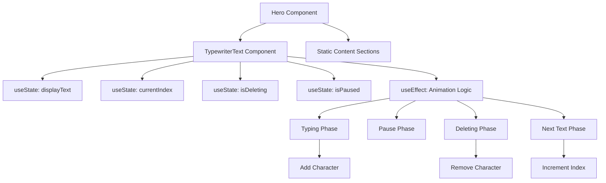
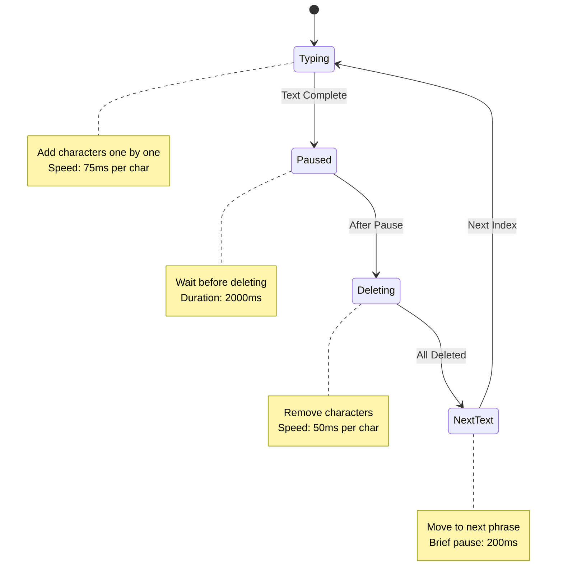

# Typewriter Animation Implementation Plan

## Overview
Add an engaging typewriter animation to the landing page that cycles through multiple phrases: "Hello, World!" → "Welcome!" → "I'm Raju Yallappa". The animation will create a dynamic, code-like introduction that fits the IDE theme of the portfolio.

## User Requirements (Confirmed)
- **Animation Style**: Cycle through multiple phrases with delete/backspace effect
- **Phrases**: 
  1. "Hello, World!"
  2. "Welcome!"
  3. "I'm Raju Yallappa"
- **Typing Speed**: 75ms per character (quick and snappy)
- **Content Display**: All other content visible from the start (no progressive fade-in)
- **Loop**: Continuous loop through all three phrases

## Current State Analysis

### Existing Hero Component
- Located at [`Hero.tsx`](../src/components/Sections/Hero.tsx:1)
- Current heading: "Hello, World!" with gradient styling and emoji
- Already has some animation infrastructure in [`index.css`](../src/index.css:31-70)
- Uses Tailwind CSS with custom theme colors

### Available Animation Infrastructure
- Existing keyframes: `blink`, `typing`, `fadeIn`, `slideUp`
- Custom CSS variables for animations
- Tailwind animation utilities configured
- Cursor blink animation already defined

## Implementation Approach

### 1. Create TypewriterText Component

**File**: `src/components/Animations/TypewriterText.tsx`

**Features**:
- Character-by-character typing animation
- Delete/backspace animation between phrases
- Configurable typing and deleting speeds
- Blinking cursor during typing
- Continuous loop through multiple texts
- Pause between typing and deleting

**Props Interface**:
```typescript
interface TypewriterTextProps {
  texts: string[];              // Array of texts to cycle through
  typingSpeed?: number;         // Speed in ms per character (default: 75)
  deletingSpeed?: number;       // Speed for backspace effect (default: 50)
  pauseDuration?: number;       // Pause after typing before delete (default: 2000)
  pauseBeforeDelete?: number;   // Pause before starting to delete (default: 1500)
  loop?: boolean;               // Whether to loop through texts (default: true)
  showCursor?: boolean;         // Show blinking cursor (default: true)
  cursorChar?: string;          // Cursor character (default: "█")
  className?: string;           // Additional CSS classes
}
```

**Animation States**:
1. **TYPING**: Adding characters one by one
2. **PAUSE**: Waiting after completing a phrase
3. **DELETING**: Removing characters one by one
4. **PAUSE_BEFORE_NEXT**: Brief pause before typing next phrase

**Implementation Logic**:
```typescript
const [displayText, setDisplayText] = useState('');
const [currentIndex, setCurrentIndex] = useState(0);
const [isDeleting, setIsDeleting] = useState(false);
const [isPaused, setIsPaused] = useState(false);

useEffect(() => {
  const currentText = texts[currentIndex];
  
  if (isPaused) {
    // Handle pause state
    const pauseTimer = setTimeout(() => {
      setIsPaused(false);
      setIsDeleting(true);
    }, pauseDuration);
    return () => clearTimeout(pauseTimer);
  }
  
  if (isDeleting) {
    // Delete characters
    if (displayText.length > 0) {
      const timer = setTimeout(() => {
        setDisplayText(displayText.slice(0, -1));
      }, deletingSpeed);
      return () => clearTimeout(timer);
    } else {
      // Move to next text
      setIsDeleting(false);
      setCurrentIndex((prev) => (prev + 1) % texts.length);
    }
  } else {
    // Type characters
    if (displayText.length < currentText.length) {
      const timer = setTimeout(() => {
        setDisplayText(currentText.slice(0, displayText.length + 1));
      }, typingSpeed);
      return () => clearTimeout(timer);
    } else {
      // Pause before deleting
      setIsPaused(true);
    }
  }
}, [displayText, currentIndex, isDeleting, isPaused]);
```

### 2. Enhanced CSS Animations

**File**: `src/index.css`

**New Keyframes to Add**:

```css
@keyframes cursorBlink {
  0%, 100% {
    opacity: 1;
  }
  50% {
    opacity: 0;
  }
}

@keyframes fadeIn {
  from {
    opacity: 0;
  }
  to {
    opacity: 1;
  }
}
```

**Utility Classes**:
```css
.animate-cursor-blink {
  animation: cursorBlink 1s step-end infinite;
}

.typewriter-cursor {
  display: inline-block;
  width: 2px;
  height: 1em;
  background-color: var(--color-ide-accent);
  margin-left: 2px;
  animation: cursorBlink 1s step-end infinite;
}
```

### 3. Update Hero Component

**File**: `src/components/Sections/Hero.tsx`

**Changes**:
1. Import the TypewriterText component
2. Replace static "Hello, World!" with TypewriterText
3. Keep all other content visible (no staggered animations)
4. Maintain existing layout and styling

**Example Integration**:
```tsx
import { TypewriterText } from '../Animations/TypewriterText';
import { profile } from '../../data/profile';

export function Hero() {
  return (
    <div className="max-w-4xl mx-auto px-1 md:px-0">
      {/* Main heading with typewriter animation */}
      <h1 className="text-2xl sm:text-3xl md:text-4xl font-bold mb-2">
        <span className="syntax-comment"># </span>
        <TypewriterText
          texts={[
            "Hello, World!",
            "Welcome!",
            `I'm ${profile.personal.name}`
          ]}
          typingSpeed={75}
          deletingSpeed={50}
          pauseDuration={2000}
          pauseBeforeDelete={1500}
          loop={true}
          showCursor={true}
          className="text-gradient inline-block"
        />
        <span className="ml-2">👋</span>
      </h1>

      {/* Rest of the content remains unchanged */}
      <div className="mt-4 md:mt-6 space-y-4">
        {/* ... existing content ... */}
      </div>
    </div>
  );
}
```

### 4. Animation Timing Breakdown

**Per Phrase Cycle**:
```
Phase 1: Type "Hello, World!" (13 chars × 75ms = 975ms)
Phase 2: Pause (2000ms)
Phase 3: Delete "Hello, World!" (13 chars × 50ms = 650ms)
Phase 4: Brief pause (200ms)

Phase 5: Type "Welcome!" (8 chars × 75ms = 600ms)
Phase 6: Pause (2000ms)
Phase 7: Delete "Welcome!" (8 chars × 50ms = 400ms)
Phase 8: Brief pause (200ms)

Phase 9: Type "I'm Raju Yallappa" (18 chars × 75ms = 1350ms)
Phase 10: Pause (2000ms)
Phase 11: Delete "I'm Raju Yallappa" (18 chars × 50ms = 900ms)
Phase 12: Brief pause (200ms)

Total cycle time: ~9.5 seconds
```

## Implementation Steps

### Step 1: Create TypewriterText Component
- Create new directory: `src/components/Animations/`
- Create `TypewriterText.tsx` with full implementation
- Add TypeScript interfaces
- Implement character-by-character animation logic with delete effect
- Add cursor blinking effect
- Handle cleanup on unmount
- Create index.ts for exports

### Step 2: Enhance CSS Animations
- Add cursor blink keyframe animation to `index.css`
- Add utility classes for cursor styling
- Ensure animations work on mobile devices
- Test cursor visibility and timing

### Step 3: Update Hero Component
- Import TypewriterText component
- Replace static heading with animated version
- Configure with three phrases and user's name
- Keep all other content visible (no animation delays)
- Test integration

### Step 4: Testing & Refinement
- Test animation loop and transitions
- Verify typing and deleting speeds
- Check cursor behavior
- Test on different screen sizes
- Verify animation performance
- Check accessibility (prefers-reduced-motion)
- Test on different browsers

## Technical Considerations

### Performance
- Use `setTimeout` instead of `setInterval` for better control
- Clean up timers on component unmount
- Avoid unnecessary re-renders
- Use `useCallback` for memoization if needed

### Accessibility
- Respect `prefers-reduced-motion` media query
- Ensure content is readable during animation
- Don't block user interaction
- Provide static fallback for reduced motion

```css
@media (prefers-reduced-motion: reduce) {
  .typewriter-text {
    animation: none !important;
  }
  .typewriter-cursor {
    animation: none !important;
    opacity: 0 !important;
  }
}
```

### Mobile Optimization
- Ensure touch interactions aren't blocked
- Test on various devices
- Verify text doesn't overflow on small screens
- Consider slightly faster animation on mobile

### Browser Compatibility
- Test in Chrome, Firefox, Safari, Edge
- Ensure cursor animation works across browsers
- Provide fallbacks for older browsers
- Test on iOS Safari and Chrome mobile

## Component Architecture



## Animation Flow



## File Structure

```
src/
├── components/
│   ├── Animations/
│   │   ├── TypewriterText.tsx       (new)
│   │   └── index.ts                 (new - exports)
│   └── Sections/
│       └── Hero.tsx                 (modified)
└── index.css                        (modified)
```

## Success Criteria

- ✅ Animation cycles through all three phrases smoothly
- ✅ Typing speed is 75ms per character
- ✅ Deleting speed is 50ms per character
- ✅ Appropriate pauses between phases
- ✅ Cursor blinks during typing
- ✅ Works on all screen sizes
- ✅ Respects reduced motion preferences
- ✅ Doesn't block user interaction
- ✅ Performance remains optimal (60fps)
- ✅ Code is maintainable and well-documented
- ✅ All other content visible immediately

## Configuration Summary

**Final Configuration**:
- **Texts**: ["Hello, World!", "Welcome!", "I'm Raju Yallappa"]
- **Typing Speed**: 75ms per character
- **Deleting Speed**: 50ms per character
- **Pause After Typing**: 2000ms
- **Pause Before Next**: 200ms
- **Loop**: Continuous (true)
- **Show Cursor**: Yes
- **Cursor Character**: "█"
- **Other Content**: Visible immediately (no staggered animations)

## Alternative Considerations

### Variant: No Delete Effect
If the delete effect feels too busy, we could:
- Type all three phrases sequentially without deleting
- Fade out old text and fade in new text
- Stack phrases vertically

### Variant: Slower Transitions
If animation feels too fast:
- Increase typing speed to 100ms
- Increase pause duration to 3000ms
- Add longer pause before deleting

## Notes

- Keep animations subtle and professional
- Ensure the emoji (👋) remains visible throughout
- The gradient effect should apply to the typed text
- Consider adding a subtle fade-in for the cursor
- Test with different name lengths for future reusability
- Monitor performance on low-end devices

## Conclusion

This plan provides a comprehensive approach to adding an engaging multi-phrase typewriter animation to the landing page. The implementation balances visual appeal with performance and user experience, creating a memorable first impression that aligns with the IDE theme of the portfolio.
